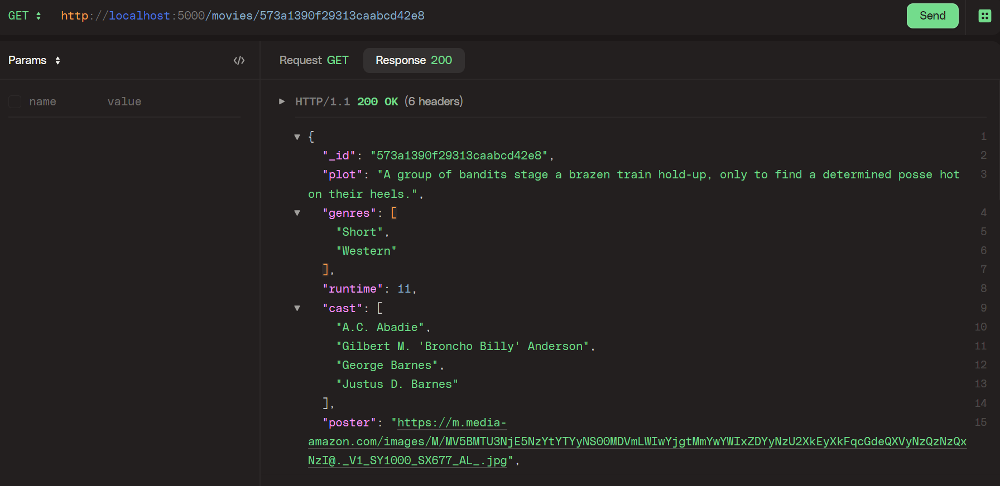

# SBA 319: MongoDB Database Application

## Introduction
This assessment measures your understanding of MongoDB and your capability to implement its features in a practical manner. You have creative freedom in the topic, material, and purpose of the web application you will be developing, so have fun with it! However, remember to plan the scope of your project to the timeline you have been given.


## Objectives
- Create a server application with Node, Express, and MongoDB.
- Create a CRUD API using Express and MongoDB.
- Use MongoDB indexing to make efficient queries.
- Create MongoDB validation rules.
- Use MongoDB validation to ensure data consistency.

## Movies Routes Requests and Responses

### GET REQUESTS
- GET REQUEST:
```
/movies
```
- RESPONSE:


- GET BY ID
```
/movies/:id
```
- RESPONSE:




### POST REQUEST

- POST REQUEST

```
/movies
```

- RESPONSE


### PUT REQUEST

- PUT REQUEST

```
/movies/:id
```

- RESPONSE:


### DELETE MOVIE REQUEST

- DELETE REQUEST:

```
/movies/:id
```

- RESPONSE:


### FAILED VALIDATIONS REQUEST

- REQUEST


- RESPONSE


## Dependencies
- dotenv
- express
- mongodb
- nodemon

## Getting Started
Clone this repo: [sba_319_MongoDB_Database_Application](https://github.com/Michle99/sba_319_MongoDB_Database_Application).


- Install dependencies:
```
npm install 
```
or

```
npm i
```

- Start local server:

```
npm run start
```