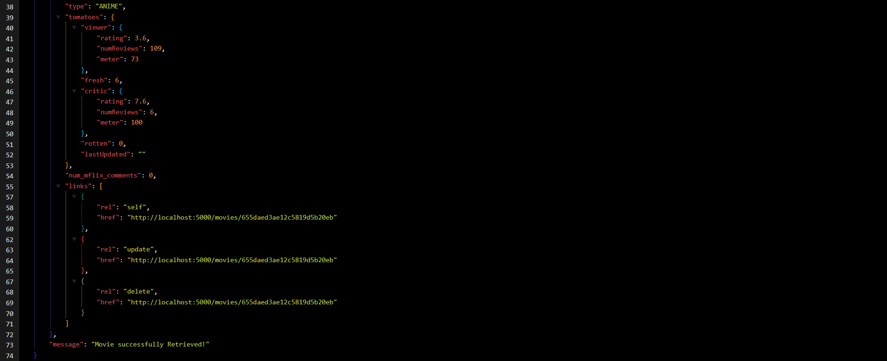

<div align="center">
  <h1>SBA 319: MongoDB Database Application</h1>
</div>
<div align="center>
      [](https://github.com/Michle99/sba_319_MongoDB_Database_Application "Go to GitHub repo")
    [](https://github.com/Michle99/sba_319_MongoDB_Database_Application)
    [](https://github.com/Michle99/sba_319_MongoDB_Database_Application)
</div>

<div>
    []        (https://github.com/Michle99/sba_319_MongoDB_Database_Application/releases/)
    [](#license)
    [](https://github.com/Michle99/sba_319_MongoDB_Database_Application/issues)
  
</div>

## Table of Contents
1. [Introduction](#introduction)
2. [Objectives](#objectives)
3. [Movies API Documentation](#movies-api-documentation)
   - [Base URL](#base-url)
   - [Get All Movies](#1-get-all-movies)
   - [Get Single Movie](#2-get-a-single-movie)
   - [Add a New Movie](#3-add-a-new-movie)
   - [Update a Movie](#4-update-a-movie)
   - [Delete a Movie](#5-delete-a-movie)
   - [Failed Validation Request](#6-failed-validations-request)
   - [Error Handling](#7-error-handling)
4. [Swagger Movie API Documentation](#swagger-movie-api-documentation)
5. [Creating a Docker Image and Container](#creating-a-docker-image-and-container)
6. [Dependencies](#dependencies)
7. [Resources](#resources)
8. [Getting Started](#getting-started)

## Introduction
This assessment measures your understanding of MongoDB and your capability to implement its features in a practical manner. You have creative freedom in the topic, material, and purpose of the web application you will be developing, so have fun with it! However, remember to plan the scope of your project to the timeline you have been given.


## Objectives
1. Create a server application with Node, Express, and MongoDB.
2. Create a CRUD API using Express and MongoDB.
3. Use MongoDB indexing to make efficient queries.
4. Create MongoDB validation rules.
5. Use MongoDB validation to ensure data consistency.

## Movies API Documentation

The Movies API allows you to manage a collection of movies. It supports CRUD (Create, Read, Update, Delete) operations to interact with movie data.

## Base URL
[http://localhost:5000/movies](http://localhost:5000/movies)


## Movies Routes Requests and Responses

### 1. Get All Movies
- **Endpoint:** `GET /`
- **Description:** Get a list of all movies.

- **Example Usage:**
```
GET http://localhost:5000/movies
```

- **Example Response:**

```json
[
  {
    "_id": {
        "$oid": "573a1391f29313caabcd7db6"
    },
    "plot": "In Paris a wild girl becomes possessed by the soul of her twin who died to save her life.",
    "genres": [
        "Drama"
    ],
    "runtime": 82,
    "cast": [
        "Betty Compson",
        "Clive Brook",
        "Henry Victor",
        "A.B. Imeson"
    ],
    "title": "White Shadows",
    "fullplot": "In Paris a wild girl becomes possessed by the soul of her twin who died to save her life.",
    "languages": [
        "English"
    ],
    "released": {
        "$date": {
        "$numberLong": "-1440892800000"
        }
    },
    "directors": [
        "Graham Cutts"
    ],
    "writers": [
        "Alfred Hitchcock",
        "Michael Morton (novel)"
    ],
    "awards": {
        "wins": 1,
        "nominations": 0,
        "text": "1 win."
    },
    "lastupdated": "2015-05-10 00:19:38.277000000",
    "year": 1924,
    "imdb": {
        "rating": 6.5,
        "votes": 156,
        "id": 15493
    },
    "countries": [
        "UK"
    ],
    "type": "movie",
    "tomatoes": {
        "viewer": {
        "rating": 2.8,
        "numReviews": 11
        },
        "lastUpdated": {
        "$date": "2015-06-14T18:00:09.000Z"
        }
    },
    "num_mflix_comments": 0
  }
  // ...
]

```
#### Get All Movies Screenshots


---

### 2. Get a Single Movie

- **Endpoint:** `GET /:id`
- **Description:** Get details of a specific movie by ID.
- Parameters:
    - id: Movie ID

- **Example Usage:**
```
GET http://localhost:5000/movies/573a1391f29313caabcd7db6
```

- **Example Response:**
```json
{
  "_id": {
    "$oid": "573a1391f29313caabcd7db6"
  },
  "plot": "In Paris a wild girl becomes possessed by the soul of her twin who died to save her life.",
  "genres": [
    "Drama"
  ],
  "runtime": 82,
  "cast": [
    "Betty Compson",
    "Clive Brook",
    "Henry Victor",
    "A.B. Imeson"
  ],
  "title": "White Shadows",
  "fullplot": "In Paris a wild girl becomes possessed by the soul of her twin who died to save her life.",
  "languages": [
    "English"
  ],
  "released": {
    "$date": {
      "$numberLong": "-1440892800000"
    }
  },
  "directors": [
    "Graham Cutts"
  ],
  "writers": [
    "Alfred Hitchcock",
    "Michael Morton (novel)"
  ],
  "awards": {
    "wins": 1,
    "nominations": 0,
    "text": "1 win."
  },
  "lastupdated": "2015-05-10 00:19:38.277000000",
  "year": 1924,
  "imdb": {
    "rating": 6.5,
    "votes": 156,
    "id": 15493
  },
  "countries": [
    "UK"
  ],
  "type": "movie",
  "tomatoes": {
    "viewer": {
      "rating": 2.8,
      "numReviews": 11
    },
    "lastUpdated": {
      "$date": "2015-06-14T18:00:09.000Z"
    }
  },
  "num_mflix_comments": 0
}
```
#### Get a Single Movie Screenshots



---

### 3. Add a New Movie
- **Endpoint:** `GET /`
- **Description:** Add a new movie to the collection.

- **Example Usage:**
```
POST http://localhost:5000/movies
```

- **Request Body:**

```json
{
  "plot": "Takuma Sakamoto, a reclusive gamer, is unexpectedly transported into the virtual world of his favorite MMORPG as his in-game character, the powerful Demon Lord Diablo. Two girls who summoned him to control him end up becoming his servants due to a magic rebound. Takuma, dealing with social anxiety, adopts his in-game persona to navigate the new world. Alongside his companions, Rem and Shera, he embarks on a quest to remove the magic collars while assisting them with their personal struggles that led to their summoning.",
  "genres": ["isekai"],
  "runtime":23,
  "cast": [
    "Diablo",
    "Sheera",
    "Rem"
  ],
  "poster": "https://thecinemaholic.com/wp-content/uploads/2021/06/How-not-to-summon.jpg",
  "title": "How not to summon a Demon Lord season 2",
  "fullplot": "Takuma Sakamoto, a reclusive gamer, is unexpectedly transported into the virtual world of his favorite MMORPG as his in-game character, the powerful Demon Lord Diablo. Two girls who summoned him to control him end up becoming his servants due to a magic rebound. Takuma, dealing with social anxiety, adopts his in-game persona to navigate the new world. Alongside his companions, Rem and Shera, he embarks on a quest to remove the magic collars while assisting them with their personal struggles that led to their summoning.",
  "languages": [
    "English"
  ],
  "released": "2021-04-09T00:00:00.000Z",
  "directors": [
    "Satoshi Kuwabara"
  ],
  "rated": "TV-G",
  "awards": {},
  "lastupdated": "",
  "year": 2018,
  "imdb": {},
  "countries": [
    "JAPAN"
  ],
  "type": "ANIME",
  "tomatoes": {
    "viewer": {},
    "fresh": 6,
    "critic": {
      "rating": 7.6,
      "numReviews": 6,
      "meter": 100
    },
    "rotten": 0,
    "lastUpdated": ""
  },
  "num_mflix_comments": 0
}

```

- **Example Response:**

```json
{
    "acknowledged": true,
    "insertedId": "6557d63b84def3c71fe4da1c"
}

```

#### Post request screenshot


---

### 4. Update a Movie 
- **Endpoint:** PUT /:id
- **Description:** Update details of a specific movie by ID.
- **Parameters:**
    - `id`: Movie ID
- **Request Body:**

```json
{
  "type": "ANIMES WEB SERIES"
}
```

- **Example Usage:**
```
PUT http://localhost:5000/movies/573a1391f29313caabcd7db6

```

- **Example Response:**
```json
{
  "acknowledged": true,
  "modifiedCount": 1,
  "upsertedId": null,
  "upsertedCount": 0,
  "matchedCount": 1
}

```

### PUT Request Screenshot


### 5. Delete a Movie
- **Endpoint: `DELETE /:id`**
- **Description:** Delete a specific movie by ID.
- **Parameters:**
    - `id`: Movie ID

- **Example Usage:**
```
DELETE http://localhost:5000/movies/573a1391f29313caabcd7db6

```

- **Example Response:**
```json
    {
    "acknowledged": true,
    "deletedCount": 1
    }
```
#### Delete Response Screenshot


### 6. FAILED VALIDATIONS REQUEST

- **Validation Rules Function:**

```
// Define validation rules for the movies collection
const validationRules = {
  $jsonSchema: {
    bsonType: "object",
    required: ["plot", "genres", "type", "title", "poster", "cast", "fullplot", "runtime"],
    // ...
  }
};
```

- **Validation Example REQUEST**


- **Validation Example Response**


### 7. Error Handling
- If the request fails, the API will respond with an appropriate error message and status code.


## Swagger Movie API Documentation
The below screenshot is the API documentation for the routers in the project.

The url to the swaggerUI API documentation is: [swaggerUI API Documentation](http://localhost:5000/api-docs/)


### Swagger API UI


### Movie Schema


#### Get All Movies video
https://github.com/Michle99/sba_319_MongoDB_Database_Application/assets/63488970/8457c782-9f1f-4459-a171-3be6b442d7e1

### Get a Single Movie
https://github.com/Michle99/sba_319_MongoDB_Database_Application/assets/63488970/957fdf2f-03bf-4b5b-b074-e4921f678288

### Post a new Movie
https://github.com/Michle99/sba_319_MongoDB_Database_Application/assets/63488970/207bb5e9-a06b-4df0-8109-0f1315fbef10

### Update an existing Movie
https://github.com/Michle99/sba_319_MongoDB_Database_Application/assets/63488970/72c681a4-c8ca-4d6c-8733-29283fe31115

### Delete an existing Movie
https://github.com/Michle99/sba_319_MongoDB_Database_Application/assets/63488970/4babab45-57f9-4e94-af9e-4d00721c10d8

## Creating a Docker Image and Container
[Docker](https://docs.docker.com) is is an open platform for developing, shipping, and running applications. Docker enables you to separate your applications from your infrastructure so you can deliver software quickly. 

- Install docker desktop application:
To create a docker container & image, download & install docker desktop: [Install Docker Desktop](https://docs.docker.com/get-docker/)
- Create a [Dockerfile](https://github.com/Michle99/sba_319_MongoDB_Database_Application/blob/main/Dockerfile) in the root directory of the project. 
- Create a `.dockerignore` to exclude modules. Sample [.dockerignore](https://github.com/Michle99/sba_319_MongoDB_Database_Application/blob/main/.dockerignore).
- Create a docker compose to define the service(s) that will be used for the project. 
[Docker Compose](https://docs.docker.com/compose/) is is a tool for defining and running multi-container Docker applications. With Compose, you use a YAML file to configure your application's services. Then, with a single command, you create and start all the services from your configuration.

Here is a sample [Docker Compose](https://github.com/Michle99/sba_319_MongoDB_Database_Application/blob/main/docker-compose.yml). 

- Lastly, build the docker container with the command:

```
docker-compose up -d --build
```

The Express application will be running on http://localhost:5000/api/movies.

- Docker Repository:
The docker image can be downloaded on hub.docker.com. Use the command to pull the docker image:

```
docker pull sam12302021/sba_319_mongodb-api
```

## Dependencies
- chai
- chai-http
- dotenv
- express
- mocha
- mongodb
- nodemon
- swagger-jsdoc
- swagger-ui-express
- yamljs


## Resources
1. [Mocha](https://mochajs.org) and [Chai](https://www.chaijs.com) for testing.
2. [Swagger](https://swagger.io/docs/specification/basic-structure/) for Movie API Documentation.
3. [Test a Node RESTful API with Mocha and Chai](https://www.digitalocean.com/community/tutorials/test-a-node-restful-api-with-mocha-and-chai)
4. [Documenting your Express API with Swagger](https://blog.logrocket.com/documenting-express-js-api-swagger/)
5. [Docker](https://docs.docker.com) to build  docker images.
6. [Docker Compose](https://docs.docker.com/compose/) for defining and running multi-container Docker applications.

## Getting Started
Clone this repo: [sba_319_MongoDB_Database_Application](https://github.com/Michle99/sba_319_MongoDB_Database_Application).


- Install dependencies:
```
npm install 
```
or

```
npm i
```

- Start local server:

```
npm run start
```
